# Improvements for VULCAN

Browser extension with improvements for eduVULCAN and Dziennik VULCAN.

## Installation

[Installation guide [PL]](https://ifv.banocean.com) 
[Adding extension to browsers for development](#development-workflow)

## Features

    
Mobile navigation

| Before:                                                         | After:                                                         |
| --------------------------------------------------------------- | -------------------------------------------------------------- |
| 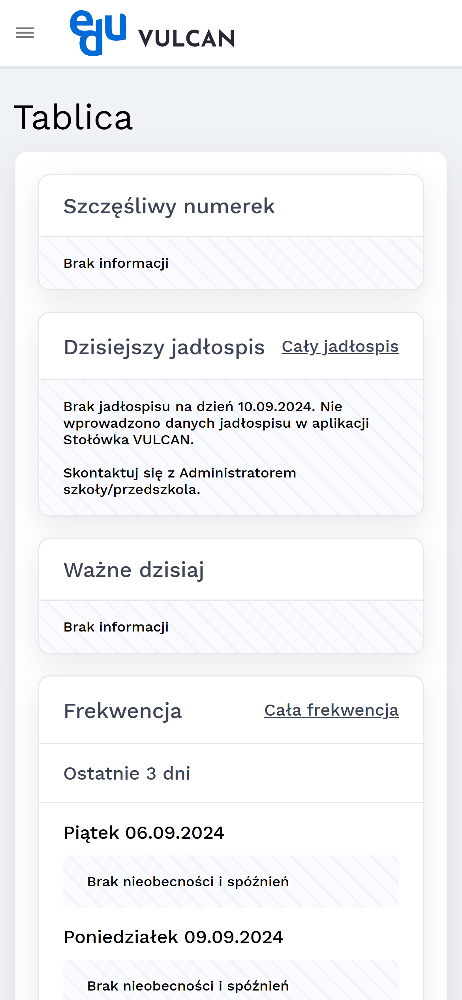 | 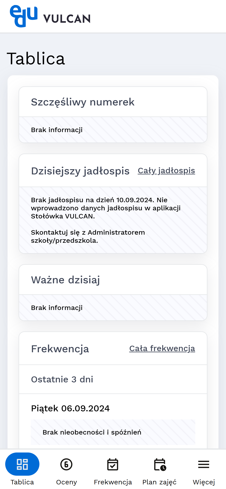 |

    
PWA support

    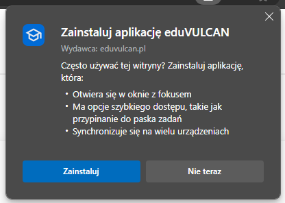

    
Attendance statistics in separate tab

| Before:                                                      | After:                                                      |
| ------------------------------------------------------------ | ----------------------------------------------------------- |
| 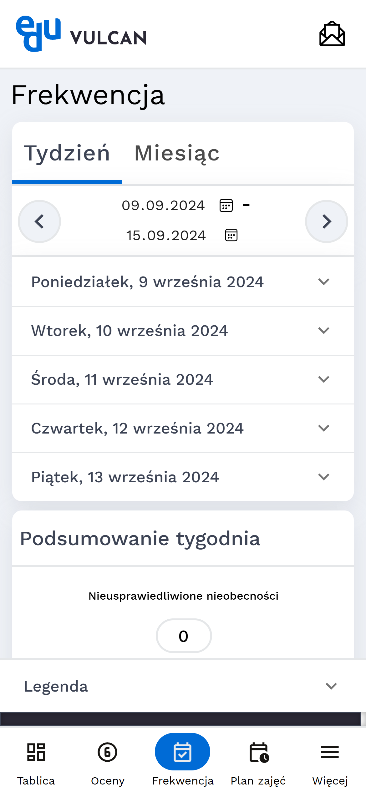 | 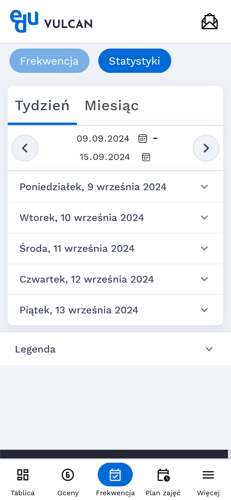 |

    
Hiding weekends in monthy calendars

    
| Before:                                                      | After:                                                      |
| ------------------------------------------------------------ | ----------------------------------------------------------- |
| 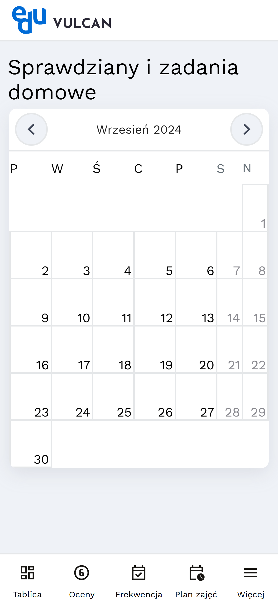 | 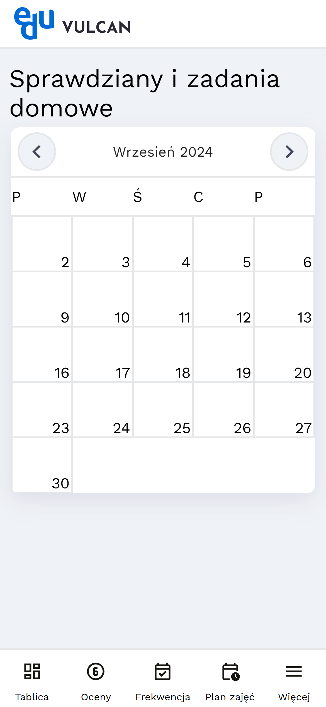 |

    
Displaying full name

| Before:                                                         | After:                                                         |
| --------------------------------------------------------------- | -------------------------------------------------------------- |
|  |  |

    
Clean student dashboard

Before:

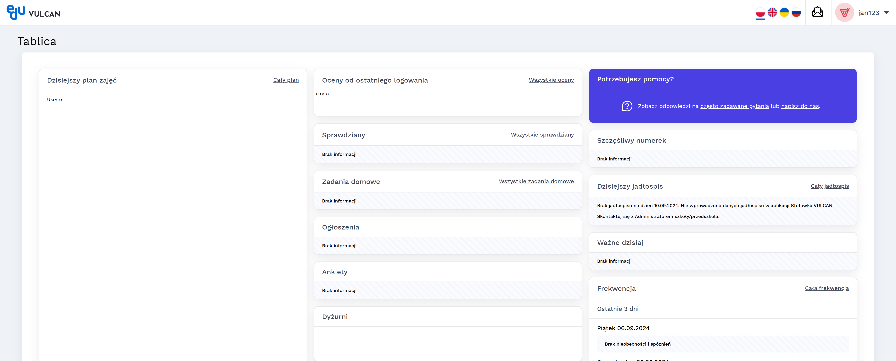

After:

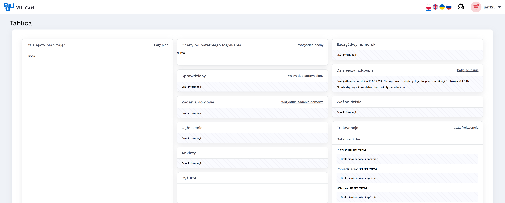

    
Clean eduVULCAN home

| Before:                                                      | After:                                                      |
| ------------------------------------------------------------ | ----------------------------------------------------------- |
|  | 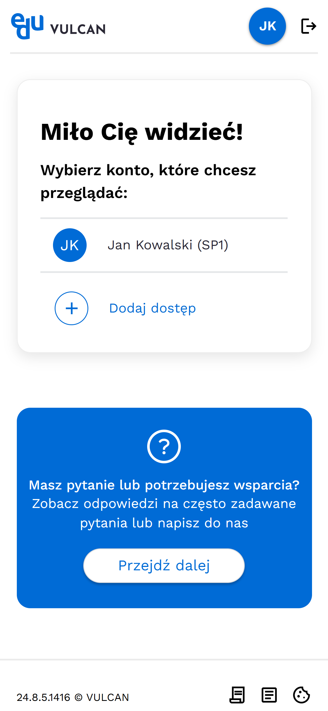 |

    
Other minor improvements

    
- Hiding WCAG controls
- Aligning detailed grades button
- Redirecting to board
- Auto redirecting to eduVULCAN login page

## Development Workflow
### Firefox
To load addon from files in Firefox, you need to go to `about:debugging#/runtime/this-firefox` and click `Load Temporary Add-on...`. After that you need to select manifest.json file in file picker. 
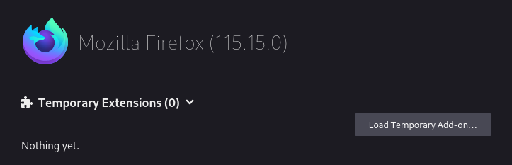
### Chrome
To load extension from files in Chrome, you need to go to `chrome://extensions/` and click `Load unpacked` (with developer mode enabled) 
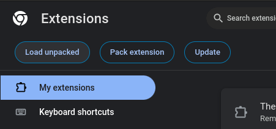

## License

This project is licensed under the [MIT License](./LICENSE).

## Contributions

Contributions to this project are welcome. Feel free to [open issues](https://github.com/banocean/ifv/issues) and [submit pull requests](https://github.com/banocean/ifv/pulls).
